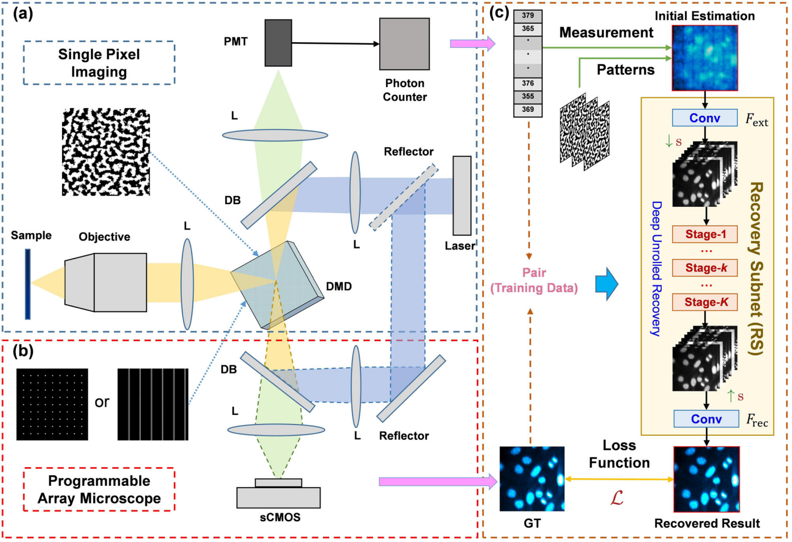

# Compressive Confocal Microscopy Imaging at the Single-Photon Level with Ultra-Low Sampling Ratios (Communications Engineering 2024) [PyTorch]

[](https://www.nature.com/articles/s44172-024-00236-x) 

Shuai Liu, [Bin Chen](https://scholar.google.com/citations?hl=en&user=aZDNm98AAAAJ), Wenzhen Zou, [Hao Sha](https://scholar.google.com/citations?user=-mqUZ8oAAAAJ), Xiaochen Feng, [Sanyang Han](https://www.sigs.tsinghua.edu.cn/hsy/main.htm), [Xiu Li](https://scholar.google.com/citations?user=Xrh1OIUAAAAJ), Xuri Yao, [Jian Zhang](https://jianzhang.tech/), and [Yongbing Zhang](https://scholar.google.com/citations?user=0KlvTEYAAAAJ)

*Tsinghua Shenzhen International Graduate School, Tsinghua University, Shenzhen, China.*

*School of Electronic and Computer Engineering, Peking University, Shenzhen, China.*

*School of Computer Science and Technology, Harbin Institute of Technology (Shenzhen), Shenzhen, China.*

*Center for Quantum Technology Research, School of Physics, Beijing Institute of Technology, Beijing, China.*

Accepted for publication in [Communications Engineering](https://www.nature.com/commseng/) (Nature Communications) 2024.

## Abstract

Laser-scanning confocal microscopy serves as a critical instrument for microscopic research in biology. However, it suffers from low imaging speed and high phototoxicity. Here we build a novel deep compressive confocal microscope, which employs a digital micromirror device as a coding mask for single-pixel imaging and a pinhole for confocal microscopic imaging respectively. Combined with a deep learning reconstruction algorithm, our system is able to achieve high-quality confocal microscopic imaging with low phototoxicity. Our imaging experiments with fluorescent microspheres demonstrate its capability of achieving single-pixel confocal imaging with a sampling ratio of only approximately 0.03% in specific sparse scenarios. Moreover, the deep compressive confocal microscope allows single-pixel imaging at the single-photon level, thus reducing the excitation light power requirement for confocal imaging and suppressing the phototoxicity. We believe that our system has great potential for long-duration and high-speed microscopic imaging of living cells.

## Overview



## Environment

```shell
torch.__version__ == '2.2.1+cu121'
numpy.__version__ == '1.24.4'
skimage.__version__ == '0.21.0'
```

## Test

```shell
python test.py --data_type=nucleus
python test.py --data_type=flureoscent_microsphere
python test.py --data_type=f-actin
python test.py --data_type=potato_tuber
```

## Train

```shell
python train.py --data_type=nucleus
python train.py --data_type=flureoscent_microsphere
python train.py --data_type=f-actin
python train.py --data_type=potato_tuber
```

The log and model files will be in `./log` and `./weight`, respectively.

## Citation

If you find the code helpful in your research or work, please cite the following paper:

```latex
@article{liu2024compressive,
  title={Compressive confocal microscopy imaging at the single-photon level with ultra-low sampling ratios},
  author={Liu, Shuai and Chen, Bin and Zou, Wenzhen and Sha, Hao and Feng, Xiaochen and Han, Sanyang and Li, Xiu and Yao, Xuri and Zhang, Jian and Zhang, Yongbing},
  journal={Communications Engineering},
  volume={3},
  number={1},
  pages={88},
  year={2024},
  publisher={Nature Publishing Group UK London}
}
```